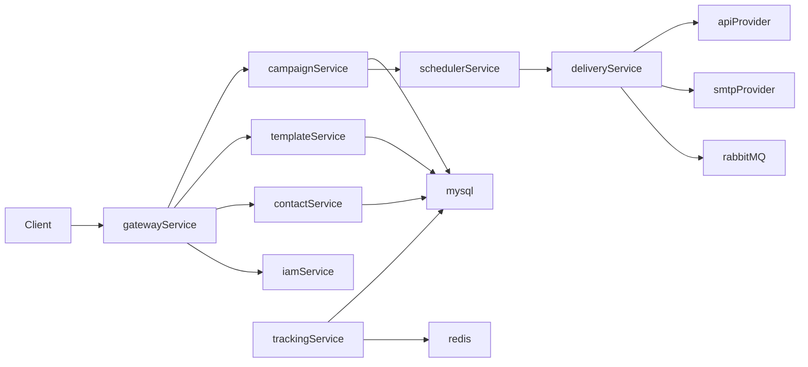

# SmartMail 后端实施计划（微服务 + 完整V1）

## 1) 当前基线与改造起点

- 现状为单模块 Spring Boot 初始工程，关键入口文件：
  - [server/pom.xml](server/pom.xml)
  - [server/src/main/java/org/example/server/ServerApplication.java](server/src/main/java/org/example/server/ServerApplication.java)
  - [server/src/main/resources/application.properties](server/src/main/resources/application.properties)
- 先将现有 `server` 改造成 Maven 多模块父工程，保留 Java 17 + Spring Boot 3，并统一依赖/BOM 管理、代码规范与基础中间件配置。

## 2) 目标微服务划分（第一版）

- `gateway-service`：统一入口、JWT鉴权、路由与限流。
- `iam-service`：用户/角色/权限、登录、JWT签发与刷新。
- `contact-service`：客户、标签、分组（静态/动态）管理。
- `template-service`：邮件模板、变量占位、版本管理。
- `campaign-service`：营销活动、A/B测试策略、发送批次管理。
- `scheduler-service`：定时任务编排、触发投递、失败重试。
- `delivery-service`：统一发送适配层（SMTP + 第三方API双通道）、投递状态回写。
- `tracking-service`：打开率/点击率追踪像素与事件接收、统计聚合。
- `audit-service`：操作审计、关键行为留痕。
- `common-*`：公共模块（安全、异常、日志、租户上下文、DTO、工具类）。

## 3) 多租户与数据策略（你选定：分Schema）

- 采用“单MySQL实例 + 每租户独立Schema”模式，应用层维护 `tenantContext`，请求入口解析租户并路由数据源。
- MyBatis-Plus 增加租户拦截与Schema路由能力（按租户动态切换 schema）。
- 基础设施库（如租户元数据、账号、全局配置）放到 `platform` schema；业务数据放租户schema。
- 严格按你给的SQL/索引规约设计：避免外键/存储过程、控制 join 深度、关键字段建立唯一索引与覆盖索引。

## 4) 关键能力分阶段落地

- 阶段A（骨架与安全）：多模块改造、网关接入、Spring Security + JWT、统一异常与审计切面。
- 阶段B（主业务闭环）：模板管理 + 客户分组 + 活动编排 + 定时发送 + 追踪埋点，打通从创建活动到看到打开率的全链路。
- 阶段C（完整V1增强）：A/B测试策略引擎、发送限流、重试与死信处理、退订与黑名单、统计报表聚合。
- 阶段D（工程化与部署）：Dockerfile、docker-compose（MySQL/Redis/RabbitMQ/各服务）、健康检查、配置分环境、基础监控日志。

## 5) API 与安全约束落地

- 接口统一前缀遵循你给的规范：`/api/{srv}/{apiCategory}`，响应码和错误体按约定统一。
- JWT 采用短期 access token + refresh token；细粒度权限到资源/动作。
- 关键接口增加幂等键（创建活动、触发发送）、防重复消费与消息去重。

## 6) 交付与验收标准（V1）

- 可创建模板、创建客户分组、创建含A/B策略的活动并定时发送。
- 同时支持 SMTP 与 API 通道，通道可按租户/活动策略切换。
- 可查看投递结果、打开率/点击率、失败原因及重试记录。
- 支持多租户（分Schema）隔离、审计日志可追溯。
- 本地一键容器化启动并可跑通端到端联调。

